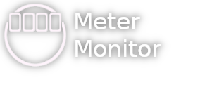
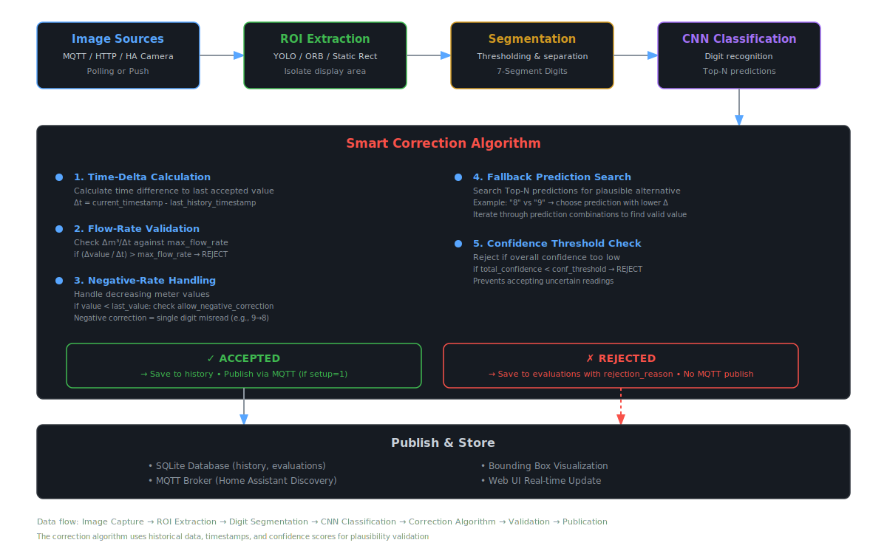

# MeterMonitor - OCR + AI for Water Meters



**MeterMonitor** is an AI-powered backend for reading analog water meters via ESP32 cameras. Instead of running OCR on-device, this solution offloads image processing and digit recognition to a server, significantly reducing device power consumption. It integrates with **Home Assistant** but can also run **standalone**.

---

## ✨ Features

### 📸 **Multiple Image Sources**
- **MQTT** - ESP32 devices push images directly
- **HTTP** - Poll any HTTP endpoint with custom headers/body
- **Home Assistant Camera** - Direct integration with HA camera entities
- Flexible polling intervals or real-time push

### 🎯 **Flexible ROI Extraction**
- **YOLO AI** - Automatic display detection using YOLOv11
- **ORB Template** - Fast feature-based matching with reference template
- **Static Rect** - Fixed rectangle for stable camera positions
- **Bypass** - Direct segmentation for pre-cropped images

### 🧠 **AI-Powered Recognition**
- CNN-based digit classification
- Top-N predictions with confidence scoring
- Multi-digit recognition with rotation detection

### 🔧 **Smart Correction Algorithm**
- Time-delta validation against historical data
- Flow-rate plausibility checks (Δm³/Δt)
- Negative correction for single-digit misreads
- Fallback prediction search through Top-N alternatives
- Configurable confidence thresholds

### 🏠 **Home Assistant Integration**
- MQTT auto-discovery for sensors
- Direct camera entity polling support
- Supervisor token authentication
- Ingress UI access

### 🖥️ **Modern Web Interface**
- Vue.js 3 dashboard
- Interactive setup wizard with live preview
- Template editor for ROI configuration
- Evaluation history with detailed rejection reasons
- Multi-meter management

### 📊 **Data Management**
- SQLite database for history and evaluations
- Configurable retention policies
- Export/import datasets for training
- Comprehensive evaluation metadata

---

This project is heavily inspired by [the AI-on-the-edge project](https://github.com/jomjol/AI-on-the-edge-device) and is trained on the dataset by the user [haverland](https://github.com/haverland/collectmeterdigits).


## 🏠 Home Assistant Setup (Recommended)

1. **Add Repo**: Add `https://github.com/metermonitor-io/metermonitor-ha` as a repository in Home Assistant.
2. **Install**: Find and install the **MeterMonitor** add-on.
3. **Configure**: Set MQTT credentials.
4. **Start & Use**: Launch the add-on. Access the UI via Ingress.

MQTT sensors are auto-discovered as long as the Mosquitto addon is used and auto discovery is enabled (default). No manual YAML needed.

The docker container is being built for the architecture `amd64` and `aarch64` (arm), with `aarch64` being untested.

---

## 🖥️ Standalone Setup

### Manual

```bash
git clone https://github.com/phiph-s/metermonitor-managementserver.git
cd metermonitor-managementserver
pip install -r requirements.txt
cd frontend && yarn install && yarn build && cd ..
python3 run.py
```

Edit `settings.json` to configure MQTT and model paths.

### Docker

```bash
git clone https://github.com/phiph-s/metermonitor-managementserver.git
docker build -t metermonitor .
docker run -d -p 8070:8070 -v ~/metermonitor-data:/data metermonitor
```

Put `options.json` in `~/metermonitor-data` (same format as `settings.json`).

---

## Project Structure

```
├── run.py                # Main entry point
├── lib/                  # Backend modules (OCR, MQTT, API)
├── models/               # YOLO & CNN models
├── frontend/             # Vue 3 web UI
├── tools/                # Utilities (e.g. MQTT bulk sender)
├── settings.json         # Config (standalone)
├── config.json           # Add-on config (Home Assistant)
```

---

## 🏗️ Architecture & Data Flow

The diagram above shows the complete processing pipeline:

1. **Image Capture** - Multiple sources (MQTT/HTTP/HA Camera) provide meter images
2. **ROI Extraction** - Isolate the display area using YOLO, ORB or Static Rect
3. **Segmentation** - Apply thresholding and island removal to extract individual digits
4. **CNN Classification** - Recognize each digit with confidence scoring
5. **Smart Correction** - Validate readings using historical data and plausibility checks
6. **Publication** - Store in database and publish via MQTT to Home Assistant

The correction algorithm ensures data quality by:
- Validating flow rates against physical limits
- Detecting single-digit misreads through fallback predictions
- Preventing unrealistic jumps in meter values
- Handling negative corrections for common OCR errors (8↔9, 3↔8)

---

Developed as Master Project @ Hochschule RheinMain

